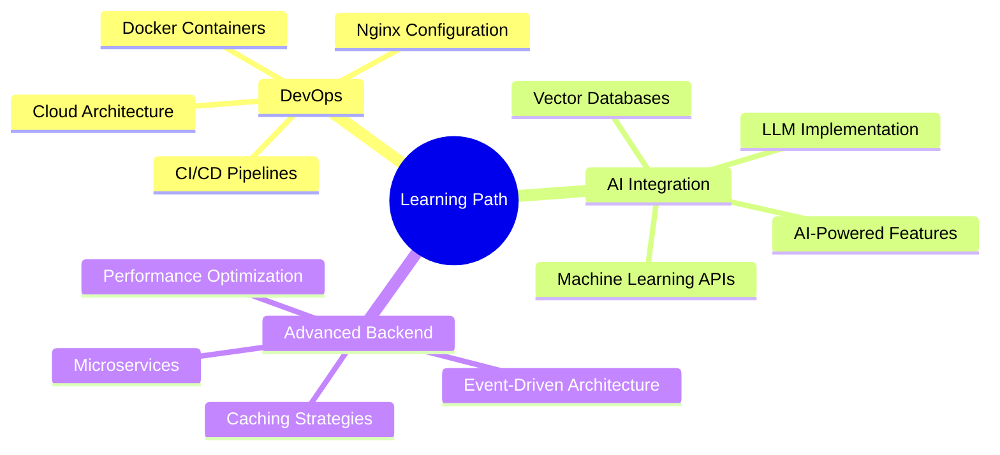

# <div align="center">👋 Hello, I'm **[Your Name]**</div>

<div align="center">
  
</div>

<div align="center">
  
</div>

---

## 🚀 **About Me**
```javascript
const developer = {
    name: "Your Name",
    role: "Full Stack Developer",
    focus: ["SaaS Development", "E-commerce Solutions", "Shopify Apps"],
    philosophy: "Code with purpose, build for impact",
    currentMission: "Transforming businesses through innovative web solutions"
};
```

---

## 💻 **Tech Arsenal**

<div align="center">

### **Frontend Mastery**
<p>
  
</p>

### **Backend Power**
<p>
  
</p>

### **Tools & Platforms**
<p>
  
</p>

</div>

---

## 🎯 **Featured Projects**

<table>
<tr>
<td width="50%">

### 🛒 **E-Commerce Powerhouse**
**Full-stack MERN application**
- 🔐 JWT Authentication & Authorization
- 💳 Stripe Payment Integration
- 📱 Responsive Design
- ⚡ Real-time Order Tracking

**Tech:** React • Node.js • MongoDB • Stripe

<div align="center">
  <a href="#"></a>
  <a href="#"></a>
</div>

</td>
<td width="50%">

### 🤖 **AI Shopify Assistant**
**Smart e-commerce optimization**
- 🧠 AI-Powered Product Recommendations
- 📈 Conversion Rate Optimization
- 🔄 Automated Upselling & Cross-selling
- 📊 Advanced Analytics Dashboard

**Tech:** Next.js • Shopify API • OpenAI • PostgreSQL

<div align="center">
  <a href="#"></a>
  <a href="#"></a>
</div>

</td>
</tr>
<tr>
<td width="50%">

### 📦 **Dropshipping SaaS Platform**
**Multi-tenant business solution**
- 👥 Multi-role User Management
- 🔄 Real-time Inventory Sync
- 💰 Affiliate Commission System
- 🏗️ Microservices Architecture

**Tech:** MERN • PostgreSQL • Apache Kafka • Docker

<div align="center">
  <a href="#"></a>
  <a href="#"></a>
</div>

</td>
<td width="50%">

### 📊 **Smart Admin Dashboard**
**Data-driven management interface**
- 📈 Interactive Data Visualizations
- 🔍 Advanced Search & Filtering
- 👨‍💼 Role-based Access Control
- ⚡ Optimized Performance

**Tech:** React • Node.js • Chart.js • Material-UI

<div align="center">
  <a href="#"></a>
  <a href="#"></a>
</div>

</td>
</tr>
</table>

---

## 📈 **GitHub Analytics**

<div align="center">
  
  
</div>

<div align="center">
  
</div>

---

## 🌱 **Growth Mindset**

<div align="center">



</div>

**Currently Exploring:**
- 🐳 **Advanced DevOps**: Docker, Kubernetes, CI/CD automation
- 🤖 **AI Integration**: Building intelligent web applications
- ☁️ **Cloud Architecture**: Scalable infrastructure design
- 🔒 **Security**: Best practices for modern web apps

---

## 🎯 **What Sets Me Apart**

<div align="center">

| 💡 **Innovation** | 🎯 **Results** | 🤝 **Collaboration** |
|:---:|:---:|:---:|
| Always exploring cutting-edge tech | Focus on business impact | Clear communication & teamwork |
| AI-powered solutions | Scalable, maintainable code | Agile development practices |
| Modern UI/UX principles | Performance optimization | Knowledge sharing |

</div>

---

## 🏆 **Achievements**

<div align="center">
  
  
  
  
</div>

---

## 📡 **Let's Connect & Build Together**

<div align="center">

[](https://yourportfolio.com)
[](https://linkedin.com/in/yourusername)
[](mailto:youremail@gmail.com)
[](https://twitter.com/yourusername)

</div>

---

<div align="center">
  
</div>

<div align="center">
  
**💼 Open to freelance projects & collaborations**  
**🚀 Ready to turn your ideas into powerful web solutions**


</div>

---

<div align="center">
  <i>⚡ Fun fact: I debug with console.log and I'm not ashamed!</i>
</div>
